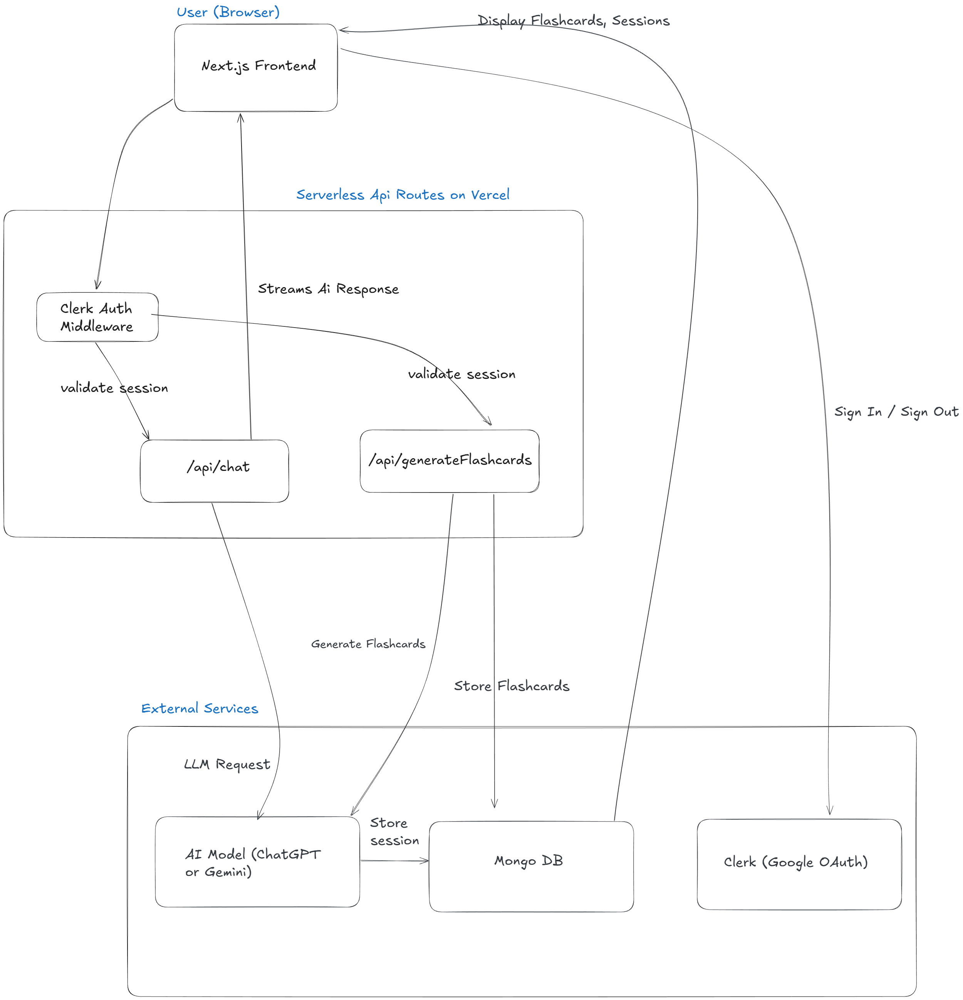

# 🧠 Lumo

**AI-powered science tutor** built with **Next.js**, **TypeScript**, and the **ChatGPT API**.
Students can chat with an AI assistant to revise Physics, Chemistry, and Biology topics, and generate flashcards for quick review.

---

## ⚙️ Architecture Overview

```
Frontend (Next.js + TypeScript)
   ↕
API Routes
   ├── /api/chat → Handles ChatGPT streaming responses
   └── /api/generateFlashcards → Generates flashcards from AI output, persisted to DB
Auth (Clerk)
DB (MongoDB Atlas) → stores users' flashcards, sessions
Deployment (Vercel - Serverless)
```

The app uses Next.js API routes for backend logic, OpenAI Chat API for generation, and MongoDB for persistence of flashcards and user session data.

---

## 🧩 Architecture Diagram



## 🧩 Design Decisions

* **Next.js + Vercel**: allows rapid full-stack development and simple deployment.
* **ChatGPT API (gpt-3.5-turbo)**: chosen for cost-efficiency and reliable educational responses.
* **Clerk (Google OAuth)**: minimal friction sign-in, secure user identity for persisted data.
* **MongoDB Atlas**: stores generated flashcards and user session history, enables resume, review, and reuse across devices.
* **Local caching plus DB writes**: keeps UI responsive while persisting results in the background.

---

## 🚫 Not Included (For Now)

* **Custom authentication system**: I'm using Clerk with Google OAuth to move faster. Building auth from scratch wasn't worth the time for a prototype.
* **Advanced personalization**: Features like adaptive learning paths or progress tracking would need more user data and testing. Maybe later.
* **Separate backend service**: Everything runs on Next.js API routes because this is a prototype. No need to complicate things with microservices right now.

---

## ⚖️ Tradeoffs & Constraints

* **Time-boxed scope**: Focused on the core tutoring experience—chat, flashcard generation, and basic persistence. Extra features can wait.
* **Simple flashcard schema**: Minimal but extensible. Good enough for the current use case.
* **No extensive testing or CI/CD**: Manual testing was sufficient for a prototype. Automated pipelines would've slowed down iteration.

---

## ⚙️ Installation & Setup

### 1️⃣ Clone the repository

```bash
git clone https://github.com/yourusername/lumo.git
cd lumo
```

### 2️⃣ Install dependencies

```bash
npm install
```

### 3️⃣ Create a `.env.local` file

```
OPENAI_API_KEY=your_openai_api_key
NEXT_PUBLIC_CLERK_PUBLISHABLE_KEY=your_clerk_frontend_key
CLERK_SECRET_KEY=your_clerk_backend_key
```

### 4️⃣ Run the development server

```bash
npm run dev
```

The app will be live at [http://localhost:3000](http://localhost:3000)

---

## 📄 License

This project is licensed under the **MIT License**.

---

> *Lumo — making science learning smarter, faster, and more
